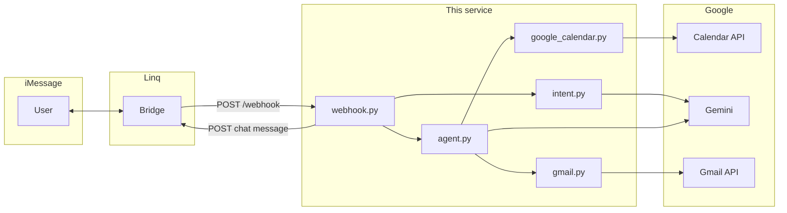

# Linq Meeting Follow-up Agent

An AI assistant you reach through **iMessage** (via [Linq](https://linqapp.com)): you say who to follow up with after a meeting, it looks up the event on **Google Calendar**, drafts a **personalized follow-up email** with **Google Gemini**, shows you the draft in the chat, and only **sends via Gmail** after you confirm.

---

## How it works (end-to-end)

1. **Linq** receives your iMessage and `POST`s JSON to your server’s `/webhook` endpoint.
2. The server ignores messages marked as sent by you (`is_from_me`) to avoid loops.
3. If your message looks like a **confirmation** (e.g. “send it”), the app sends the **pending draft** for that chat via the Gmail API.
4. Otherwise it uses **Gemini** to extract **who** to follow up with and any **notes** from your message.
5. It searches **Google Calendar** (primary calendar, last N days) for a matching attendee or event title (**fuzzy matching**).
6. It asks **Gemini** again to produce **to / subject / body** JSON for the email, with a simple template fallback if parsing fails.
7. The draft is stored **in memory** keyed by Linq `chat_id` and returned as plain text in iMessage.
8. The server **POSTs the reply** to Linq’s Partner API so you see it in the same thread.



---

## Current scope vs. product wording

| Capability | Status |
|------------|--------|
| iMessage in/out via Linq | Implemented |
| Calendar lookup + fuzzy name match | Implemented |
| Draft email with Gemini (+ notes from your message) | Implemented |
| Send only after explicit confirmation | Implemented |
| Read prior **Gmail thread** for context | **Not implemented** — Gmail is used to **send** (and `create_draft` exists but is unused by the agent). Drafting uses calendar + your iMessage notes + Gemini only. |

---

## Requirements

- Python **3.12+**
- [uv](https://github.com/astral-sh/uv) or another way to install dependencies from `pyproject.toml`
- A Linq Partner setup with **API key** and a **webhook** pointing at your deployed `/webhook` URL
- **Google Cloud** OAuth client (`credentials.json`) with Calendar + Gmail scopes (see `src/auth.py`)
- **Gemini API** key

---

## Getting started (first-time setup)

### 1) Clone and enter the project

```bash
git clone https://github.com/<your-org-or-user>/linq-meeting-followup-agent.git
cd linq-meeting-followup-agent/linqFollowoUpagent
```

### 2) Install dependencies

```bash
uv sync
```

### 3) Create `.env`

Create a file named `.env` in the repository root:

```bash
cat > .env <<'EOF'
LINQ_API_KEY=your_linq_partner_api_key
LINQ_PHONE_NUMBER=your_linq_number
GEMINI_API_KEY=your_gemini_api_key
EOF
```

### 4) Configure Google OAuth (Calendar + Gmail)

1. In Google Cloud Console, create/select a project.
2. Enable:
   - Google Calendar API
   - Gmail API
3. Configure OAuth consent screen.
4. Create OAuth client credentials for a Desktop app.
5. Download the JSON and place it as:
   - `credentials.json` in the repository root.

### 5) Start the API locally

```bash
uv run uvicorn src.webhook:app --host 0.0.0.0 --port 8000
```

### 6) Expose your local webhook URL

If running locally, expose port `8000` publicly (for example with Cloudflare Tunnel, ngrok, or your own reverse proxy), then set Linq webhook URL to:

`https://<public-url>/webhook`

### 7) Connect Linq to your server

In your Linq Partner configuration:

- Set the webhook URL to your public `/webhook` endpoint.
- Confirm requests are being delivered (you should see `PAYLOAD:` logs in your terminal).

### 8) Complete first-run Google authentication

On the first workflow that touches Google APIs, the app opens a browser for OAuth consent. After successful login:

- `token.json` is created in the repository root.
- Future runs reuse and refresh this token automatically.

### 9) End-to-end smoke test

Send an iMessage routed through Linq:

`Follow up with Alex, mention strong communication and quick turnaround.`

Expected result:

1. Bot returns a draft with `To`, `Subject`, and email body.
2. Reply with `send it`.
3. Bot confirms send and email appears in Gmail sent mail.

### 10) Development notes

- `pending_drafts` are stored in memory only; restarting the server clears pending confirmations.
- Run the server from the repo root so relative `credentials.json` / `token.json` paths resolve correctly.
- `main.py` is not the runtime entrypoint; use `src.webhook:app`.

---

## Configuration

Create a `.env` in the project root (loaded by `src/config.py`):

| Variable | Purpose |
|----------|---------|
| `LINQ_API_KEY` | Bearer token for `https://api.linqapp.com/api/partner/v3/chats/{chat_id}/messages` |
| `LINQ_PHONE_NUMBER` | Required by config validation (used for your Linq / routing setup) |
| `GEMINI_API_KEY` | Google GenAI client |

Place **`credentials.json`** (OAuth client secret JSON) in the **working directory** from which you start the server (usually the repo root). After first auth, **`token.json`** is written alongside it.

`src/config.py` also defines:

- `GEMINI_MODEL` (e.g. `gemini-2.5-flash`)
- `CALENDAR_LOOKBACK_DAYS` (default **7**)
- `FUZZY_MATCH_THRESHOLD` for [thefuzz](https://github.com/seatgeek/thefuzz) partial ratio (default **70**)

---

## Run the server

From the repository root (so `src` imports and relative `token.json` / `credentials.json` paths resolve as expected):

```bash
uv sync
uv run uvicorn src.webhook:app --host 0.0.0.0 --port 8000
```

Expose `https://your-host/webhook` to Linq’s webhook configuration.

`main.py` is a placeholder CLI; the live app is **`src.webhook:app`**.

---

## HTTP contract (Linq)

### Inbound: `POST /webhook`

The handler expects JSON shaped like:

- `data.is_from_me` — if `true`, the handler returns immediately (no reply).
- `data.chat_id` — Linq chat identifier; used for replies and for **pending draft** storage.
- `data.message.parts[0].value` — user text (first text part).

### Outbound reply

The server posts to:

`https://api.linqapp.com/api/partner/v3/chats/{chat_id}/messages`

with header `Authorization: Bearer {LINQ_API_KEY}` and body:

```json
{
  "message": {
    "parts": [{ "type": "text", "value": "<reply string>" }]
  }
}
```

---

## Conversation flow

1. **Follow-up request** — e.g. “Follow up with Alex, great culture fit.”  
   - Gemini extracts `name` + `notes`.  
   - Calendar match → draft → shown in iMessage.  
   - Draft is stored in `pending_drafts[chat_id]` (RAM only; **lost on restart**).

2. **Confirmation** — phrases include: `send it`, `yes send`, `send the email`, `confirm`, `go ahead` (see `CONFIRMATION_PHRASES` in `src/agent.py`).  
   - Matched **before** intent extraction so “send it” does not get parsed as a new person.  
   - Sends the pending `DraftEmail` via Gmail.

3. **Unknown intent** — if extraction yields `name == "unknown"`, the user gets a short clarification prompt.

The bot text mentions **“edit: …”** as a hint for changes; **that path is not implemented** — only confirm-send and new requests are handled in code.

---

## Project layout

| Path | Role |
|------|------|
| `src/webhook.py` | FastAPI app: validates Linq payload, routes to intent vs confirmation, posts reply to Linq. |
| `src/agent.py` | Orchestration: `find_meeting` → `draft_email` (Gemini) → `pending_drafts`; on confirm, `send_email`. |
| `src/intent.py` | Gemini JSON extraction → `Intent(name, action, notes)`. |
| `src/models.py` | Pydantic models: `Intent`, `Meeting`, `DraftEmail`. |
| `src/google_calendar.py` | Calendar API list + fuzzy match on title and attendees → `Meeting` or `None`. |
| `src/gmail.py` | `send_email` (used); `create_draft` (Gmail draft API, **not** wired into the agent). |
| `src/auth.py` | OAuth flow; scopes: calendar read-only, Gmail modify. |
| `src/config.py` | Env loading, Gemini client, tunables. |
| `src/populate_calendar.py` | Test event seeder — **entire file is commented out**; uncomment to run locally as a script. |
| `main.py` | Unused hello-world entrypoint. |

---

## Google OAuth scopes

Defined in `src/auth.py`:

- `https://www.googleapis.com/auth/calendar.readonly`
- `https://www.googleapis.com/auth/gmail.modify`

First run may open a browser for consent; tokens persist in `token.json`.

---

## Dependencies (summary)

See `pyproject.toml` for pinned versions. Notable packages: **FastAPI**, **Uvicorn**, **httpx**, **google-api-python-client**, **google-auth-oauthlib**, **google-genai**, **thefuzz**, **python-dotenv**.

---

## Troubleshooting

- **“Could not find a meeting”** — Name must match an attendee or event title in the lookback window; try full name or check `CALENDAR_LOOKBACK_DAYS` / threshold.
- **No pending draft on confirm** — Server restarted (in-memory store cleared) or different `chat_id`.
- **401 / 429 from Gemini** — API key or quota; see logs in `intent.py` / `agent.py`.
- **`token.json` / path issues** — Run Uvicorn from the directory where `credentials.json` lives, or adjust `auth.py` to absolute paths.

---

## License

This project is licensed under the terms of the [MIT license](LICENSE).
